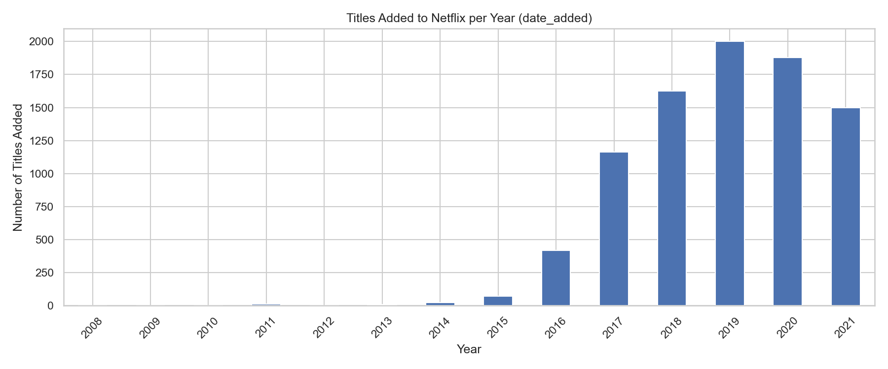
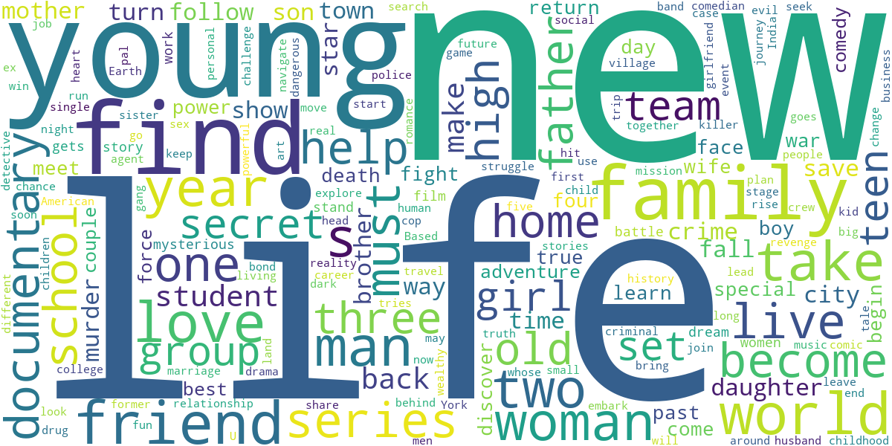

# 📊 Netflix Movies and TV Shows Analysis

##  Project Overview
This project analyzes the Netflix Movies and TV Shows dataset to uncover insights about:
- Content distribution over the years
- Popular genres and ratings
- Trends in movie/TV show releases
- Word cloud of descriptions
- Top directors on Netflix
- Data cleaning
- Visualization (Top Directors, Ratings, Release Year Trends, etc.)
- WordCloud for descriptions


---

## 📂 Dataset
- **netflix_titles.csv** → Original dataset containing Netflix content details.
- **netflix_cleaned.csv** → Cleaned dataset after preprocessing.

Dataset contains:
- `type` → Movie or TV Show  
- `title` → Name of the content  
- `director` → Director name  
- `cast` → Main actors/actresses  
- `country` → Country of production  
- `date_added` → Date added to Netflix  
- `release_year` → Release year  
- `rating` → Content rating (e.g., TV-MA, PG-13)  
- `duration` → Duration (in minutes or seasons)  
- `listed_in` → Genre(s)  
- `description` → Short summary  

---

##  Tools & Libraries
- **Python** (Data Analysis)
- **Pandas** (Data Handling)
- **Matplotlib** & **Seaborn** (Visualization)
- **WordCloud** (Text Analysis)
- **Jupyter Notebook** (Interactive Analysis)

---

##  Analysis & Visualizations
1. **Content Added Over the Years**
   

2. **Release Year Trends**
   

3. **Top Directors**
   

4. **Rating Distribution**
   

5. **Word Cloud from Descriptions**
   

---

##  How to Run
1. Clone this repository:
   ```bash
   git clone https://github.com/nidhi-yadav20799/Netflix-Analysis.git
